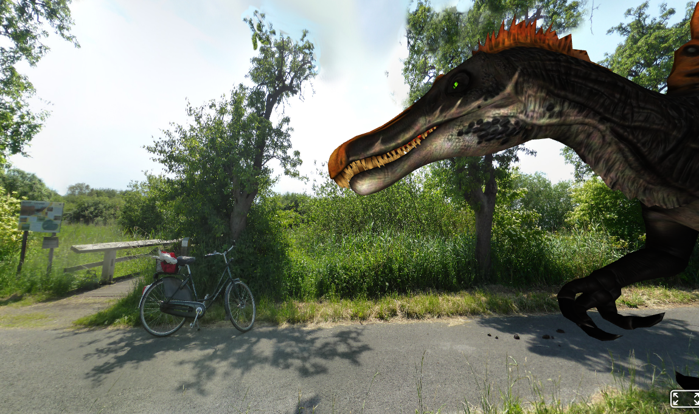

# HuginSample
This repository provides a sample image source for the Panorama photo stitcher - [Hugin](http://hugin.sourceforge.net/download/). It was created as support files for a [Wikiversity Learning Resource about 3D Modelling](https://en.wikiversity.org/wiki/3D_Modelling).
People that want to learn about creating [360 degree panoramas e.g. with AFrame](https://aframe.io/examples/showcase/sky/) can use this [set of sample images](https://github.com/niebert/HuginSample/archive/master.zip) to play around with [Hugin](http://hugin.sourceforge.net/download/).
* Create a panorama with Hugin
* Fix missing areas in the panorama and correct the projection with [GIMP](https://www.gimp.org/downloads/)

See the [Final result of your efforts in AFrame](https://niebert.github.io/HuginSample)

## Intermediate Steps fpr Creating an Equirectangular Image
* Use the images in `durlach_saumarkt` of this repository to play around with Hugin.
* **([Missing Ground](https://niebert.github.io/HuginSample/index_missing_ground.html))** You might end up with an unmatched ground like this, because you missed to take images for the ground underneath yourself.
* **[Final](https://niebert.github.io/HuginSample/durlach_saumarkt.html)**

## Combine with Aframe Objects
The equirectangular images in [AFrame](https://aframe.io) are the first step for the background.
You can also add geometrical elements into the scene.
* See [Geometrical Objects in a 360-Degree Image](https://niebert.github.io/HuginSample/cloud_grass_plam.html)
* [Crystal Lattice in AFrame](https://niebert.github.io/HuginSample/crystal_lattice_aframe.html)
* [Crystal Lattice with an equirectangular background image](https://niebert.github.io/HuginSample/crystal_lattice_sky.html)
* [Dinosaur 3D model with an equirectangular background image](https://niebert.github.io/HuginSample/spinosaurus_rieselfelder_aframe.html)

* The dinosaur (Spinosaurus) is 3D model called "primal carnage spinosaurus" (URL: https://skfb.ly/pswyN) created by `seth the yutyrannus`. The 3D model is licensed under Creative Commons Attribution (http://creativecommons.org/licenses/by/4.0/).
## Examples of Equirectangular Images - AFrame
Equirectangular images can be used in [AFrame](https://aframe.io) for a 360-degree panorama view.
* [**AFrame Example** - Puy de Sancy](https://aframe.io/examples/showcase/sky/)
* [**Durlach - Saumarkt** - Karlsruhe, Germany](https://niebert.github.io/HuginSample/durlach_saumarkt.html)  - [Equirectangular Image](https://niebert.github.io/HuginSample/img/durlach_saumarkt.jpg) - image is licensed under the [Creative Commons](https://en.wikipedia.org/wiki/en:Creative_Commons) [Attribution-Share Alike 4.0 International license](https://creativecommons.org/licenses/by-sa/4.0/deed.en)
* [**Rieselfelder Münster**](https://niebert.github.io/HuginSample/rieselfelder1.html) - [Equirectangular Image](https://niebert.github.io/HuginSample/img/rhein1_rodenkirchen.jpg) - image is licensed under the [Creative Commons](https://en.wikipedia.org/wiki/en:Creative_Commons) [Attribution-Share Alike 4.0 International license](https://creativecommons.org/licenses/by-sa/4.0/deed.en).
* [**Rheinauen - Cologne 1**](https://niebert.github.io/HuginSample/rhein1_rodenkirchen.html) - [Equirectangular Image](https://niebert.github.io/HuginSample/img/rhein1_rodenkirchen.jpg) - image is licensed under the [Creative Commons](https://en.wikipedia.org/wiki/en:Creative_Commons) [Attribution-Share Alike 4.0 International license](https://creativecommons.org/licenses/by-sa/4.0/deed.en).
* [**Rheinauen - Cologne 2**](https://niebert.github.io/HuginSample/rhein2_rodenkirchen.html) - [Equirectangular Image](https://niebert.github.io/HuginSample/img/rhein1_rodenkirchen.jpg) - image is licensed under the [Creative Commons](https://en.wikipedia.org/wiki/en:Creative_Commons) [Attribution-Share Alike 4.0 International license](https://creativecommons.org/licenses/by-sa/4.0/deed.en).
* [**Rheinauen - Cologne 3**](https://niebert.github.io/HuginSample/rhein3_rodenkirchen.html) - [Equirectangular Image](https://niebert.github.io/HuginSample/img/rhein1_rodenkirchen.jpg) - image is licensed under the [Creative Commons](https://en.wikipedia.org/wiki/en:Creative_Commons) [Attribution-Share Alike 4.0 International license](https://creativecommons.org/licenses/by-sa/4.0/deed.en).
* [**Rheinauen - Cologne 4**](https://niebert.github.io/HuginSample/rhein4_rodenkirchen.html) - [Equirectangular Image](https://niebert.github.io/HuginSample/img/rhein1_rodenkirchen.jpg) - image is licensed under the [Creative Commons](https://en.wikipedia.org/wiki/en:Creative_Commons) [Attribution-Share Alike 4.0 International license](https://creativecommons.org/licenses/by-sa/4.0/deed.en).
* [**Foschungsanlage Eusserthal**](https://niebert.github.io/HuginSample/eusserthal.html)
* [**Jelgava Palace**](https://niebert.github.io/HuginSample/Jelgavas_pils.html) - [WikiCommons Source File](https://commons.wikimedia.org/wiki/File:Jelgavas_pils.jpg) - Uldins Bardins (2011) - image is licensed under the [Creative Commons](https://en.wikipedia.org/wiki/en:Creative_Commons) [Attribution-Share Alike 4.0 International license](https://creativecommons.org/licenses/by-sa/4.0/deed.en). [GeoLoc](https://commons.wikimedia.org/wiki/File:Jelgavas_pils.jpg#/maplink/0)
* [**Aldara Park**](https://niebert.github.io/HuginSample/Aldara_parks.html) - [WikiCommons Source File](https://commons.wikimedia.org/wiki/File:Aldara_parks.jpg) - Uldins Bardins (2011) image is licensed under the [Creative Commons](https://en.wikipedia.org/wiki/en:Creative_Commons) [Attribution-Share Alike 4.0 International license](https://creativecommons.org/licenses/by-sa/4.0/deed.en). [GeoLoc](https://commons.wikimedia.org/wiki/File:Aldara_parks.jpg#/maplink/0)

## 3D Modelling. AR and Aframe Scenes
If you want to go further you can explore
*  [AFrame and Augmented Reality](https://github.com/AR-js-org/AR.js) with the [AR.js Documentation](https://ar-js-org.github.io/AR.js-Docs/) including Geolocation based Augmented Reality with AFrame,
* learn about [3D Modelling in Wikiversity](https://en.wikiversity.org/wiki/3D_Modelling)
* start creating your Aframe scene with equirectangular images with [JSON3D4Aframe](https://github.com/niebert/JSON3D4Aframe).
* learn about [tracking objects with Javascript](https://trackingjs.com)

## Hugin
* Download [Hugin](http://hugin.sourceforge.net/download/)
* Install Hugin on your Operating System
* Load all the JPG images in the folder ___/durlach_saumarkt___ which are a bunch of JPG images of a market place in the town Karlsruhe-Durlach in Germany.
* Let Hugin align all the images for you (depending on the number of images and the performance of you computer it takes few minutes until this process is performed)
* Save the panorama to your local harddrive.
* You will see that the generated image is generated up-side-down. You can easily fix that by rotation of the output with you image editing software (e.g. [GIMP](https://www.gimp.org/downloads/))

## Spherical (equirectangular) Images for AFrame
If you want to play around with equirectangular images and view them in Aframe check the [MediaWiki Commons Images of equirectangular projections](https://commons.wikimedia.org/wiki/Category:Equirectangular_projection). Please cite the authors when you used the images.

## Fixing the Panorama
### Fixing the Gimp Output for AFrame 360 Degree Panorama
* If you use the panorama in AFrame scale the image in the vertical y-axis. A blank area at bottom of the Hugin output panorama should appear.
* The blank area at the botton is approximately 1/5 of the total height of the image.
* After exporting the image with GIMP and using in  [360 degree panoramas in AFrame](https://aframe.io/examples/showcase/sky/) on the ground you will see a white circle. This circle can be covered the GIMP Clone Tool.

### Fixing Missing Images in the Panorama with [GIMP](https://www.gimp.org/downloads/)
In the collection of images from the Durlachsome areas of the sky and from the ground are missing. Due to changes in light it was impossible to collect the missing images later.

The missing areas in the panorama are
* in the sky and
* on the ground

Use clone in [GIMP](https://www.gimp.org/downloads/) to fix the missing areas from the sky
* Copy some area from the ground and scale it and use it for the missing center on the ground
* Blend the scale images with image environment with "clone" in GIMP (see [Youtube Video about Clone Tool](https://www.youtube.com/watch?v=OsjGFadLtA8))

## Wikiversity
The sample image belong to the introduction in [3D Modelling on Wikiversity](https://en.wikiversity.org/wiki/3D_Modelling/Examples).

## Use generated Panorama in AFrame 360 Degree Image
The provide example is designed as learning resource for the generation of [360 degree images in AFrame](https://aframe.io/examples/showcase/sky/)

## Download OpenSource software
You can download the free OpenSource Software Hugin for all major Operating Systems
* Linux,
* MacOSX and
* Windows.

For MacOSX and Windows go to the following  website for downloading
:: Download [Hugin](http://hugin.sourceforge.net/download/)
For Linux Operating Systems you can install the software with your package manager.

## Video Tutorial for Hugin
* [Intro to The Hugin Panorama photo stitcher](https://www.youtube.com/watch?v=O_gONzUndQo) by Brian Cluff - Youtube 2017/02/07
* [Hugin Part 1 - Overview and Stitching 3 Photos](https://www.youtube.com/watch?v=bGF4d_jX8K0) by Jamie Hamel-Smith - Youtube 2017/02/07
* [Hugin Part 2 - Hugin Part 2 - De-Fishing an Image and Straightening a Pattern](https://www.youtube.com/watch?v=bGF4d_jX8K0) by Jamie Hamel-Smith - Youtube 2017/02/07

## Acknowledgement
Thank you to [the developers of Hugin](http://hugin.sourceforge.net/community/authors/) for providing this advanced panorama stitching tool for all major operating systems as OpenSource software.
